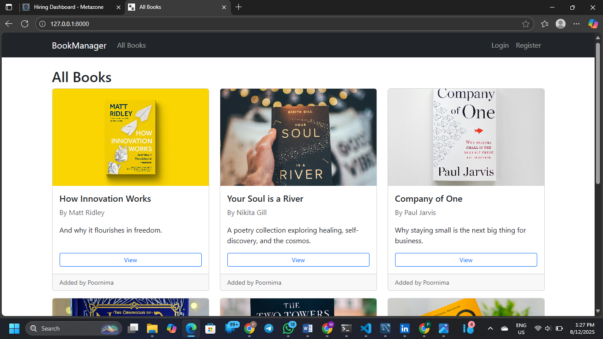
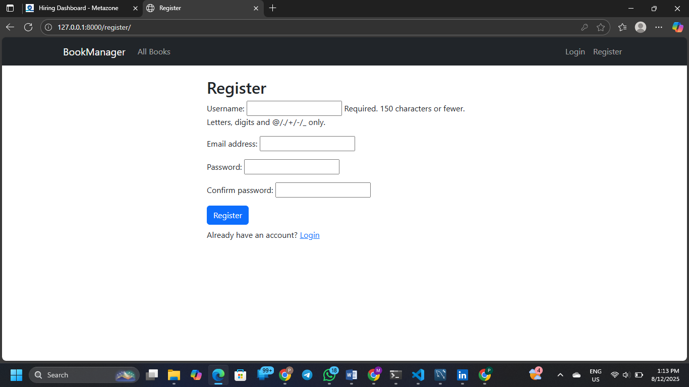
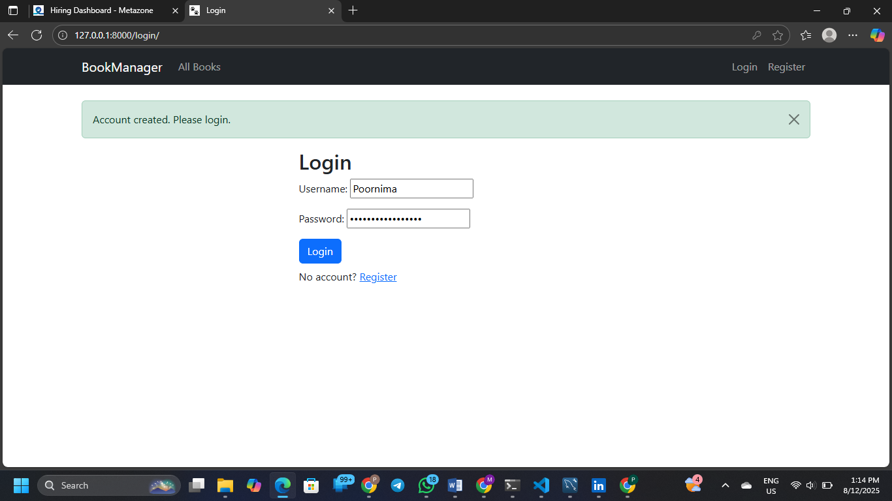
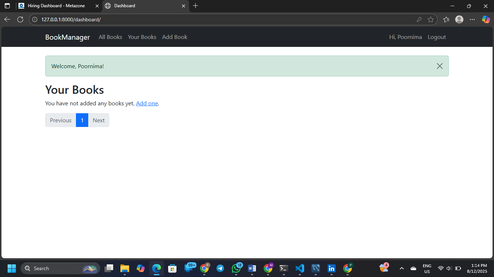
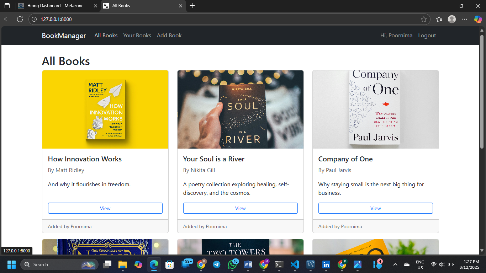
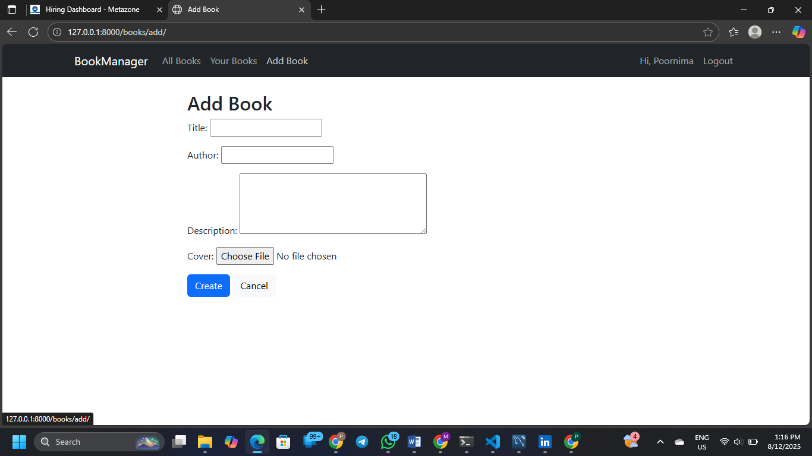
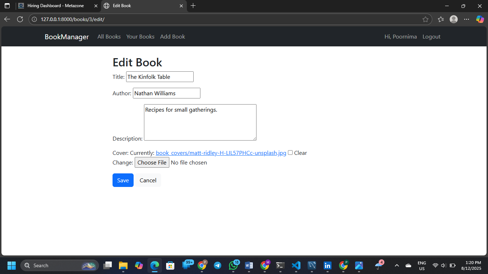
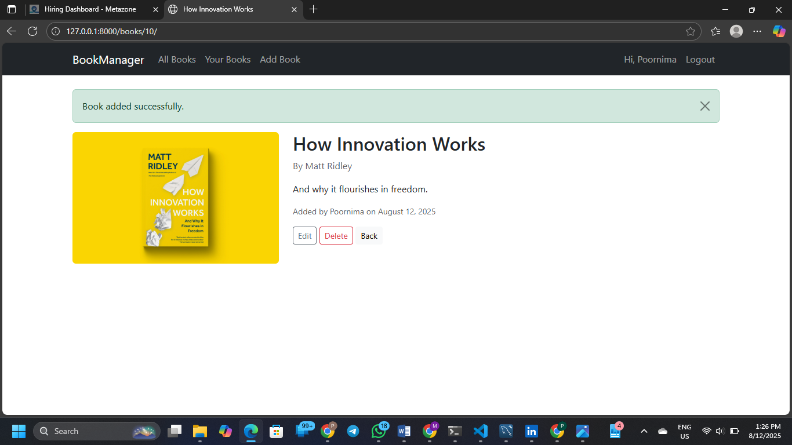

#  Book Manager

A Django-based **Book Management System** with MySQL integration.  
This project allows users to manage books (add, edit, delete and view) with a clean UI and secure backend.


## 🚀 Features
- Add, edit, delete, and view books
- MySQL database for data storage
- Django template-based UI
- Static files management with `whitenoise`
- Environment variables for security
- Ready for deployment on **Render**


##  Screenshots

###  Home Page


###  Register Page


###  Login Page


###  Dashboard Page




###  Add Book


###  Edit Book


###  View Page


### Delete Page


## Technologies Used
- **Backend:** Django 5
- **Database:** MySQL
- **Frontend:** HTML, CSS (Django Templates)
- **Deployment:** Render(Not Yet)
- **Other Tools:** `python-dotenv`, `whitenoise`


## Project Structure
```
bookmanager/
├── bookmanager/          # Django project settings
├── books/                # Book management app
├── templates/
│   └── books/            # HTML templates
├── static/
│   └── css/              # CSS files
├── screenshots/          # Project screenshots
├── manage.py
├── requirements.txt
├── Procfile
├── .gitignore
└── README.md
```

## Setup Instructions
1️⃣ Clone the Repository
```bash
git clone https://github.com/PoornimaChowdary560/bookmanager.git
cd bookmanager
```
2️⃣ Create a Virtual Environment and activate it
```bash
python -m venv venv
```
3️⃣ Install Dependencies
```bash
pip install -r requirements.txt
```
4️⃣ Configure Environment Variables

Create a .env file in the root directory and add:
```bash
SECRET_KEY=your_secret_key
DEBUG=True
DB_NAME=your_db_name
DB_USER=your_db_user
DB_PASSWORD=your_db_password
DB_HOST=localhost
DB_PORT=3306
```
5️⃣ Apply Migrations
```bash
python manage.py migrate
```
6️⃣ Create Superuser (Optional)
```bash
python manage.py createsuperuser
```
7️⃣ Run the Development Server
```bash
python manage.py runserver
```

Open your browser and visit:
👉 http://127.0.0.1:8000/


## License

This project is licensed under the MIT .
You are free to use, modify, and distribute this project.

## Contact

If you have questions or want to collaborate:

GitHub: PoornimaChowdary560

Email: poornimamaddipati22@gmail.com.com

