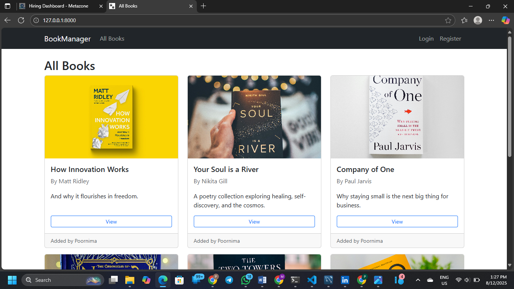
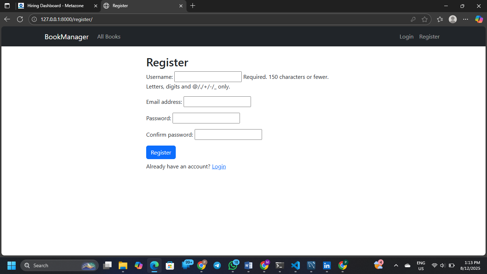
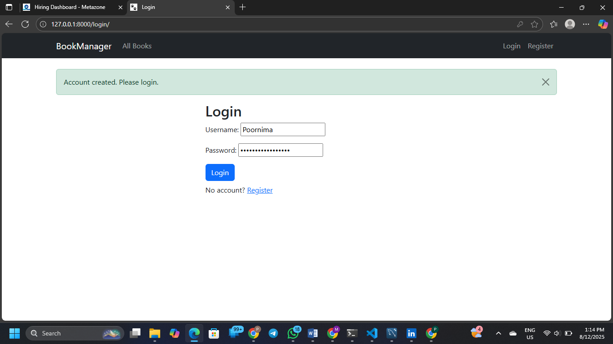
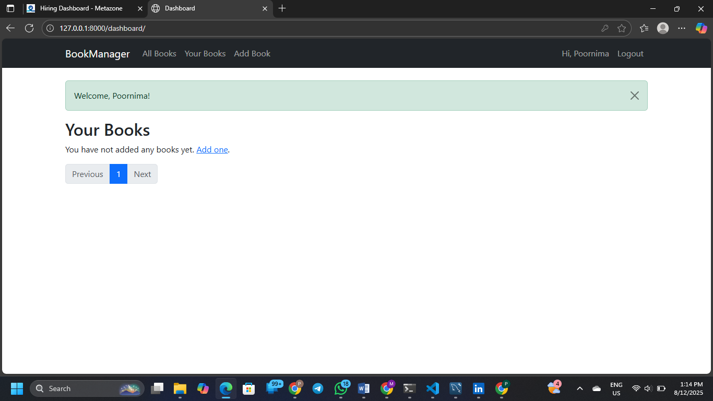
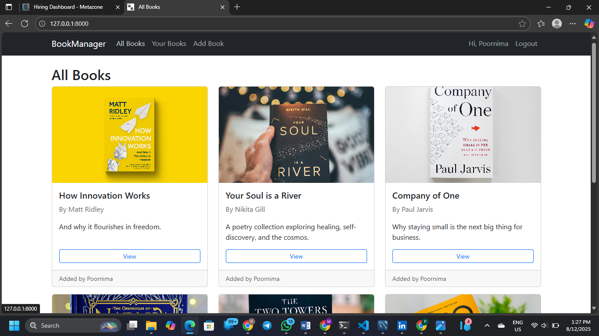
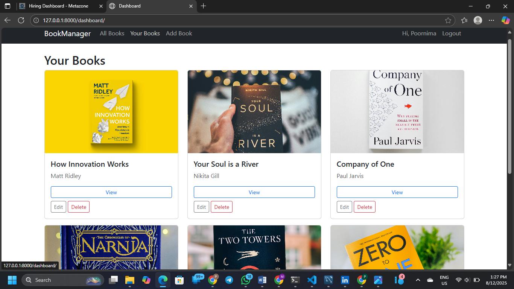
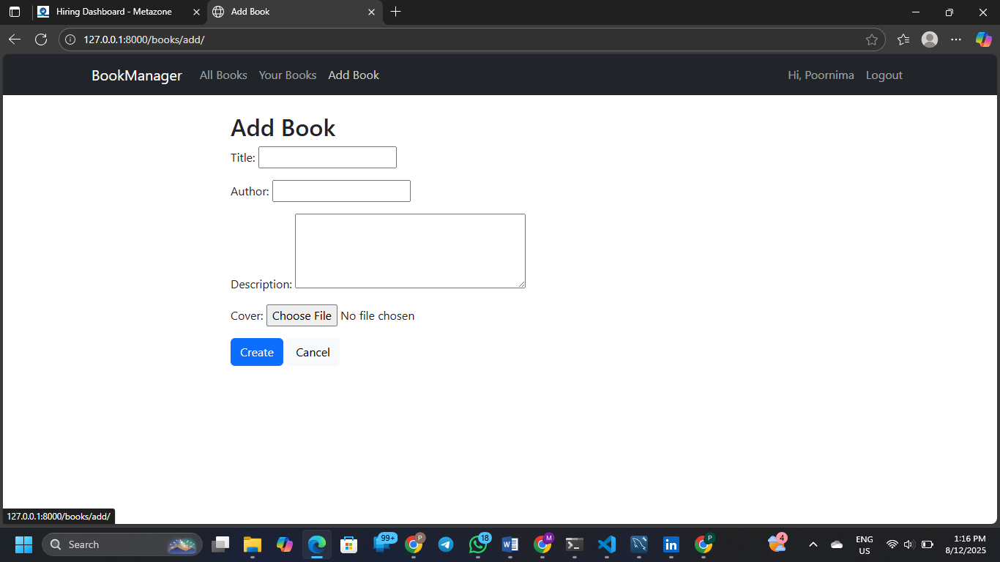
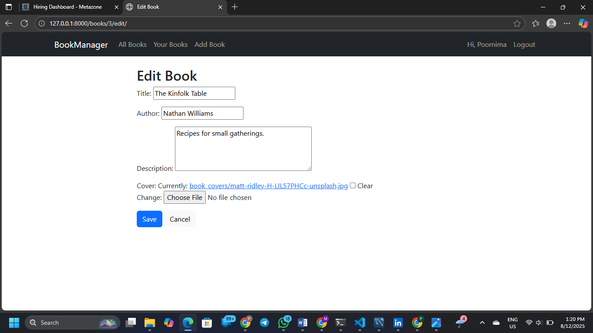
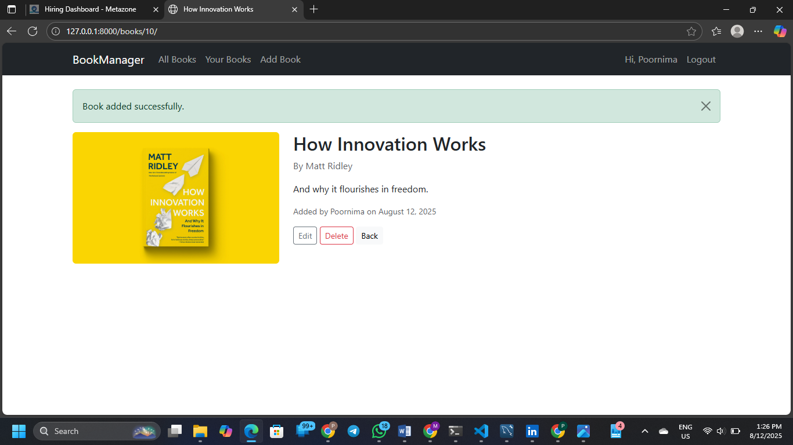
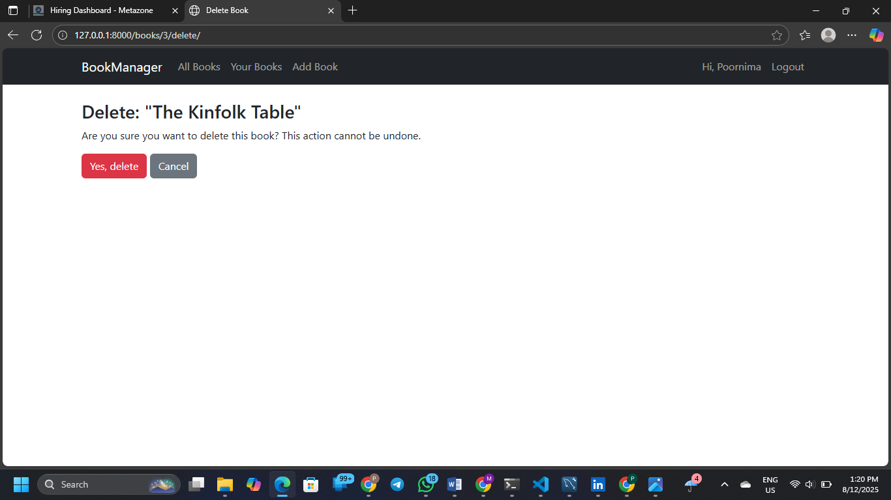

#  Book Manager

A Django-based **Book Management System** with MySQL integration.  
This project allows users to manage books (add, edit, delete and view) with a clean UI and secure backend.

## 🚀 Features
- Add, edit, delete, and view books
- MySQL database for data storage
- Django template-based UI
- Static files management with `whitenoise`
- Environment variables for security
- Ready for deployment on **Render**

##  Screenshots

###  Home Page

###  Register Page

###  Login Page

###  Dashboard Page

###  Add Book

###  Edit Book

###  View Page

### Delete Page

## Technologies Used
- **Backend:** Django 5
- **Database:** MySQL
- **Frontend:** HTML, CSS (Django Templates)
- **Deployment:** Render(Not Yet)
- **Other Tools:** `python-dotenv`, `whitenoise`

##  Installation

### 1️⃣ Clone the Repository

git clone https://github.com/yourusername/bookmanager.git

cd bookmanager
